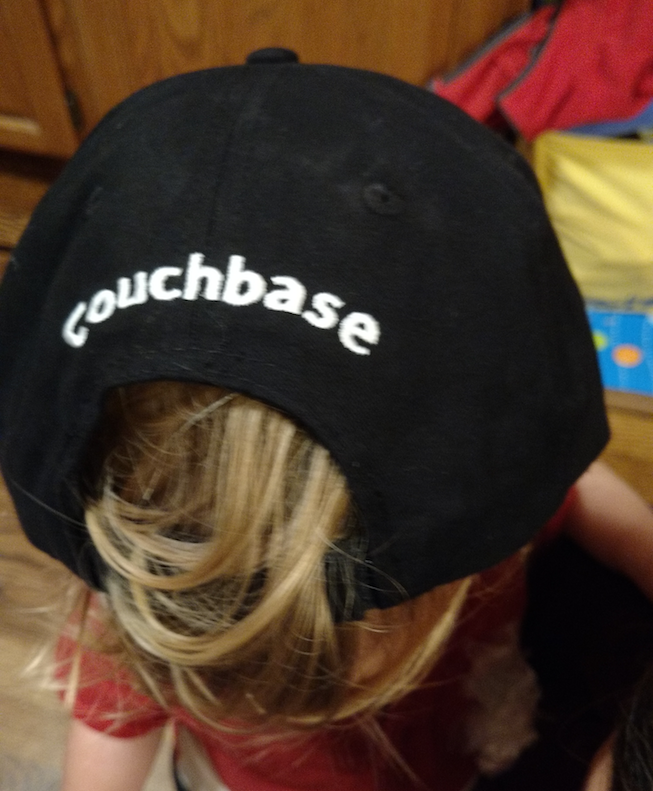

Howdy everyone.  I'm in my third week here at http://www.couchbase.com[Couchbase] in Mountain View, CA.  I've joined the developer advocacy team where I'll focus mainly on http://developer.couchbase.com/mobile/[Couchbase for Mobile].  This will be my first official post, so allow me to introduce myself.

I've been a bit of a technology wanderer. I started programming on my father's HP calculator.  Since then I've worked on everything from Cray supercomputers, experimental parallel systems, on down to playing with Raspberry Pi.  I've even designed and built my own PC.  (To be clear, I designed the circuits back then.  Nowadays I just buy the parts!)  

On the software side, I've worked as a developer in scientific computing (hence the Cray), built products across a wide range of areas in computer security, did a stint in finance, and generally poke around in whatever I find interesting.

Most recently I come from Samsung, where I led developer relations for mobile in North America.  I've gotten to see mobile evolve starting from the early days of Android.  It's been amazing.  (Small confession: I held on to my black and white Nokia candy bar phone until after the second generation iPhone.  It took me a while to be persuaded!)  I have a collection of Android phones.  Some look like museum pieces, even though they're only five or six years old.

Depending on how you measure, mobile became the dominant way people access the Internet in the USA sometime around https://www.consumerbarometer.com/en/trending/?countryCode=US&category=TRN-NOFILTER-ALL&trending=TREN-US-CAT-NOFILTER-ALL-CHART-8[2014].  The bar for mobile apps has definitely risen.  Couchbase is one of the few companies in the world of https://www.thoughtworks.com/insights/blog/nosql-databases-overview[NoSQL] databases that has a strong mobile offering. I'm psyched to join Couchbase to work with developers to use this tech to build better apps.

On the personal side, lately I've been spending a lot of time working in my yard,

image::images/CBII1.png[caption="", title="A 6,000 lbs skid steer, stuck in the mud"]

and playing with my kid

Looking forward to meeting you.

Hod

